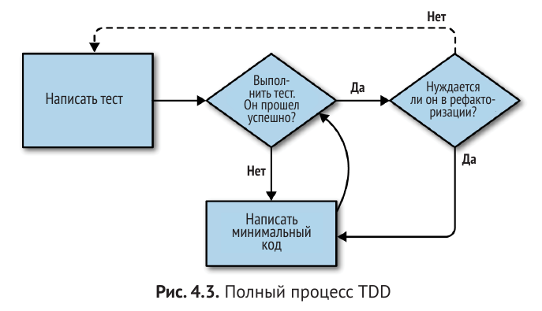

# TDD with django

## Part 1: TDD and Django basics
Процесс разработки конечного ПО подразделяется на три этапа:
1) Этап непосредственной разработки(development)
2) Этап подготовки к внедрению или промежуточный этап(staging)
3) Этап внедрения в производственную среду или производственный этап(production)

TDD
1) Написать тест
2) Убеждаемся, что тест не проходит
3) Создаем нужный функционал приложения, чтобы тест был пройден
<!-- TODO: Кто-то украл 4й пункт - нужно вернуть!!! -->
4) 

Функциональный тест позволяет увидеть, как приложение функционирует с точки зрения пользователя

Он позволяет эмулировать историю пользователя по взаимодействию с приложеним, а точнее - с конкретными его элементами. Так же позволяет определить, как эти элементы должны на это "пользовательское взаимодействие" отвечать.

Терминология:
фунциональный тест==приемочный тест==сквозной тест

Фунциональные тесты должны иметь удобочитаемую историю, которую можно прослеживать. Мы определяем ее в явной форме, используя комментарии, которые сопровождают программный код тесте. При создании нового функционального тестирования мы сначала пишем комментарии, чтобы зафиксировать ключевые моменты в истории пользователя.


Полезные понятия TDD
*История пользователя*
  Описание того, как приложение будет работать с точки зрения пользователя. Используется для структурирования функционального теста.
*Ожидаемая неполадка*
  Когда тест не срабатывает ожидаемым для нас образом.


Отличия модульных тестов от функциональных
Граница между их различиями время от времени может становиться немного расплывчатой. Однако, основное
различие заключается в том, что функциональные тесты проверяют приложение с внешней стороны - с точки зрения пользователя. Модульные тесты проверяют приложения изнутри - с точки зрения программиста.
Подход TDD, который приводит эта книга, хочет, чтобы приложение было охвачено обоими типами тестов. Поток
операций будет примерно таким:
  1. Мы начинаем с написания *функционального теста*, описываюшеющего новую функциональность с точки зрения пользователя.
  2. Когда у нас есть функциональный тест, который не срабатывает, мы начинаем думать о том, как написать код, который может заставить его пройти успешно(или по крайней мере заставить перешагнуть через текущую неполадку). Теперь мы используем один или несколько *модульных тестов*, чтобы выработать поведение кода, которого мы хотим добиться. Смысл в том, что каждая строка производственного программного кода, которую мы пишем, должна быть протестирована по крайней мере одним из наших модульных тестов.
  3. Когда у нас есть неработающий модульный тест, мы пишем минимально возможный объем прикладного кода - ровно столько, чтобы модульный тест прошел успешно. Мы можем несколько раз итеративно переключаться между шагами 2 и 3, пока не убедимся, что функциональный тест продвинулся чуть дальше.
  4. Теперь мы можем выполнить функциональные тесты повторно и убедиться, что они проходят или продвинулись немного дальше. Этот этап может нас побудить написать немного новых модульных тестов и нового исходного кода и т.д.

MVC в Django, URL-адреса и функции представления
Программная инфраструктура Django во многом структурирована согласно классическому шаблону проектирования "Модель-Прелставление-Контроллер"(MVC).
Именно *во многом*. Она определенно имеет модели, но ее представления больше походят на котроллер, и именно шаблоны визуализации на самом деле реализуют представления, но общая идея именно та же самая.

## Цикл "модульный тест/программный код"
Теперь мы можем начать осваивать цикл TDD "модульный тест/программный код":
  1. В терминале выполните модульные тесты и убедитесь, что они не срабатывают.
  2. В редакторе внесите минимальное изменение в программный код, чтобы решить текущую неполадку теста.

И повторите!
Чем больше мы нервничаем по поводу приведения нашего кода в правильное состояние, тем меньше должно быть каждое изменение кода, которое мы вноситм. Смысл в том, чтобы быть абсолютно уверенным, то каждый фрагмент кода обоснован тестом.
Такой процесс может показаться трудоемким, и сначала так и будет. Но как только вы войдете в ритм, вы обнаружите, что разрабатываете программный код быстро, даже если делаеие микроскопические шаги. Так мы пишем весь наш производственный программный код на работе.


## Правило "Не тестировать констаннты и шаблоны во спасение"

Другими словами, если у вас есть некий программный код, который говорит:
`wibble = 3`

нет особо смысла в тесте, который говорит:
```
from myprogram import wibble
assert wibble == 3
```

Модульные тесты на самом деле занимаются проверкой логики, потока управления и конфигурации.
Утверждения о том, какая именно последовательность символов имеется в нашей HTML-размете, этого не дают.

Что более важно: выжимать сырые строки в Python – это на самом деле далеко не самый хороший способ работы с HTML. Существует намного более хорошее решение, которое заключается в использовании шаблонов.

Один из способов протестировать шаблон - вручную преобразовать шаблон в HTML-разметку в самом тесте и сравнить с тем, что возвращает представление. В Django есть функция `render_to_string`, которая позволяет это делать: `from django.template.loader import render_to_string`

Во время рефакторизации работайте либо с программным кодом, либо с тестами, но не с двумя сразу.
Делайте маленькие шаги; продолжайте выполнять рефакторизацию, а функциональные изменения - совершенно отдельно.

## Резюме: процесс TDD
Мы увидели все основные аспекты процесса TDD на практике:
  - Функциональные тесты
  - Модульные тесты
  - Цикл "модульный тест/программный код"
  - Рефакторизация



Мы пишем тест. Мы его выполняем и видим, что он не срабатывает.
Мы пишем какой-то минимальный программный код, чтобы продвинуться чуть-чуть дальше.
Повторно выполняем тест и повторяем до тех пор, пока он не сработает.
Затем, как дополнительный вариант, можно выполнить рефакторизацию программного кода, используя тесты, чтобы удостовериться, что мы ничего не повредили.

Остановился на: 85 стр
